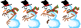
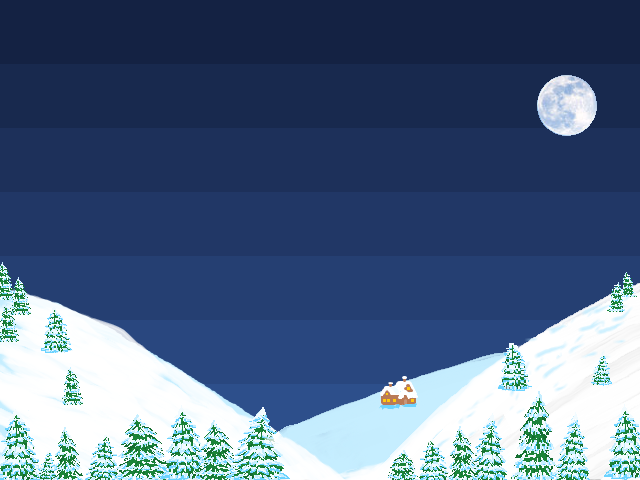
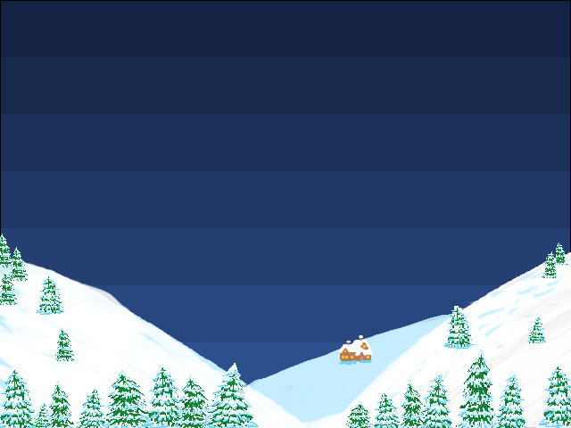

# An Xmas Adventure

Live site: https://andrewdempsey2018.github.io/An-Xmas-Adventure/

DISASTER!!! It's Chrismas Eve and the forces of evil have succeeded in their nefarious quest to destroy Christmas! Using their patented ReindeerMind technology, they confused Rudolph just enough for the Santa to loose control of the sleigh resulting in all the presents being lost, falling to earth! Santa must now combat the forces of evil to collect all the presents and save Christmas!  
 
     
An Xmas Adventure is a retro platfom game. The player takes control of Santa and the goal is to collect as many presents as you can whilst avoiding or destroying the enemies with Santas vicious 'Sack Attack'. On each level the player should aim to collect as many presents as possible and get to Rudolph before the time runs out!  
 
 

---

> # PLANNING & DEVELOPMENT

The key user functionality and experiences that the game aims to deliver were discussed are detail in the UX section.

Sketches were created to solidify the vision of the game amoungst the team before development hand in order to have a visual goal on how each level will look like and the movement of the sprites.

# User Experience (UX)

## Project Goals

- To create a retro game, in looks, gameplay and sound, that should generate nostalgia (for those familiar with the 16bit era) and fun for all players.
- The game should be straightfoward and simple, with minimal controls and instructions required
- The player should be able to start playing within moments of entering the sites
- Create a full gameplay loop with multiple levels
- Have a score system
- Be able to save the scores

## First time visitor goal

Our goal for a first time user is to:

- Be able to play immidietly
- Pick up on the controls immediately
- Feel like they are playing on a 16bit console (if they are old enough to remember!)
- Feel festive!
   
   

---

> # Features

# Controls

The user will move Santa using their arrows on their keyboard as follows:

- Run right: right arrow key
- Run left: left arrow key
- Jump: space bar
- hit: z key

# Gameplay Goals

- Collect as many presents as possible
- Avoid or destroy the enemies in the enemies
- Complete the level within the time limited (not implemented)
- Get a high score (not implemented)

# Graphics

All graphics are bespoke and were created for this project.

## Santa sprite:

(note: at the time of writing the last frame (santa being hit) has not been implemented)

## Evil Snowman sprite:

  

(note: at the time of writing the last frame (evil snowman being hit) has not been implemented)

## Snowman Minion sprite:

  

(note: at the time of writing the last frame (minion snowman being hit) has not been implemented)

## Presents to collect

 
 
 
  
 
 

## Possessed present sprite:

The implementation of the possessed present was not achieved within the alloted development time. The idea was that the enemy would represent an additional challenge to the player.

  
  
  
  

 

## Rudolph and Sleigh

Rudolph and his sleigh are there to represent the level exit on each level. However this was not managed to be implemented within the alloted development time.

 
 

## Backgrounds

The following backgrounds were created, however only the clear sky with moon one was used. It is planned that the other will be used on future levels.

 
 
 
 
 

# Sfx

Sounds play when the following actions take place on the player controlled Santa Sprite:
Jump: jump.wav
Pick up presents: pickup.wav
hit enemy: hit.wav

# Soundtrack

The game has fun upbeat retro take on jingle bells
 

# Features Left to Implement

- The app was not able to be made responsive for use on mobile devices within the alloted project time. This will be a number one priority to implement in the future.
- End of level acknowledgement with rudolph and sleigh representing this.
- Progress to subsequent level
- A score tally for the collection of presents and enemies destroyed
- Level timer with points award for completing a level quickly
- An incremental ability mechanic. Initially it was planned for the jump heigh of Santa to increase as he collects more presents. This, combined with the level timer would add a puzzle element to the game where the player had to figure out the optimum route through the level to collect all presents.
- Implementation of 'possessed parcel' enemy.
- implementation of attacked by frames for all Sprites
- A variety of different Christmas tunes for the levels
   
   

> # **BUGS & FIXES**

- We had an issue where Santa was able to jump multiple times in mid air. Kaboom provides a flag for easily checking weather a character is on the floor. We just needed to apply this flag to asimple if statement in our jumping code:
   
  ` //jump keyPress("space", () => { if (santa.isGrounded()) { santa.jump(JUMP_HEIGHT); play("jump"); } });`

 

---

> # **DEVELOPMENT & DEPLOYMENT**

- All development was completed amoung team members using Gitpod and Visual Studio code. Code was regularly pushed back to the GitHub repository.
- For version control we utilized the Git and push to a GitHub repo

---

# Website deployment

The following steps were taken in GitHub to deploy the site and can be replicated:

1. Login to GitHub
2. From the list of repositories select the desired repository
3. From the list of nine options underneath the repository name; select ‘Settings’
4. Scroll down to the section titled ‘GitHub Pages’
5. In that section, under ‘source’, click the drop down menu and select the ‘master’ branch
6. In the drop down menu next to that select ‘root’
7. Click save
8. A message is displayed in this section stating that the site is published and the address of the site. Click this to view the site

Please see [here](https://docs.github.com/en/free-pro-team@latest/github/working-with-github-pages/configuring-a-publishing-source-for-your-github-pages-site#choosing-a-publishing-source) for the GitHub Docs page on this process.

---

# Running the project locally

To work on the project code locally a clone can be taken by following the steps below or downloading the files as a zip file. To see the options open the desired repository and select the drop down menu button ‘Code’ (found under the repo name and above the list of files)

## Clone:

To do this you will need [GitBash for Windows](https://gitforwindows.org/) installed (for other OS versions see https://git-scm.com/downloads).

1. Open GitBash
2. Change the current working directory is required. On windows, by default, the files will be downloaded to the users file directory on the C: drive
3. In the ‘Code’ dropdown menu in GitHub, select either HTTPS or SSH and copy the link.
4. In the GitBash window type ‘git clone’ and then paste the copied link.
5. Hit Enter and the files will then be cloned to be worked on locally.

Please see [here](https://docs.github.com/en/free-pro-team@latest/github/creating-cloning-and-archiving-repositories/cloning-a-repository) for the GitHub Docs page on this process.

 

> # **CREDITS**

The moon image graphic used in the background was sampled from the following image:
https://photos.com/featured/1-winter-moon-yourapechkin.html
 

# Languages used

- Javascript
- HTML
- CSS

# Techonologies used

## Microsoft Paint

MS Paint was used to quickly create the sprites and backgrounds.

## GIMP (GNU Image Manipulation Program)

GIMP was used to apply translucency around the sprites and backgrounds as required following creation in MS paint.

## BFXR

We used BFXR to generate the games sounds effects. BFXR is a free tool by Stephen Lavelle that generates retro style sound effects and allows them to be exported to various file formats. The UI consists of mixers, dials and buttons that allow easy customisation of waveforms, pitch, reverb and arpeggiation amongst other effects. The tool is used widely in the retro game development community and the assets created from it are licence free. BFXR is packaged as a downloadable executable.
The software can be downloaded at https://www.bfxr.net/

## Tiled

We used Tiled by Thorbjørn Lindeijer to create our level maps. Tiled is a 2D level editor that helps create tile maps of various forms. It supports straight rectangular tile layers, but also projected isometric, staggered isometric and staggered hexagonal layers. A tile set can be either a single image containing many tiles, or it can be a collection of individual images. In order to support certain depth faking techniques, tiles and layers can be offset by a custom distance and their rendering order can be configured. Tiled also allows layering of tile maps meaning we were able to create a collision layer for Santa to interact with as well as a decoration layer to enhance the background graphics detail.
Tiled is free and available at https://www.mapeditor.org/

## MIDI

We originally wanted to use a MIDI keyboard to create some Christmas themed music. Our intention was to use an 8 bit VST instrument to produce the classic sound. With the time constraints of the Hackathon, we had to scale back on our plan in this department. Instead, we downloaded free to use Christmas MIDI files from here: https://www.westnet.com/Holiday/midi/

## GSXCC

We then used a free program called GSXCC by Toda Naoki aka 'GASHISOFT'. This program emulates the sound chips of classic game consoles. It also plays MIDI files and can process MIDI through any of the emulated sound chips. We used the Nintendo NES pre-set and filtered our favourite tunes through it. We feel the music really adds to the overall retro and Christmas feel.
You can download GSXCC emulator here:
https://meme.institute/gxscc/

Used 'colourDesigner' Gradient generator to help with the background sky colours: https://colordesigner.io/gradient-generator
