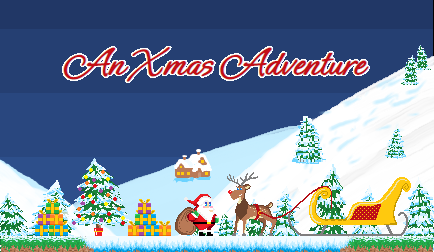
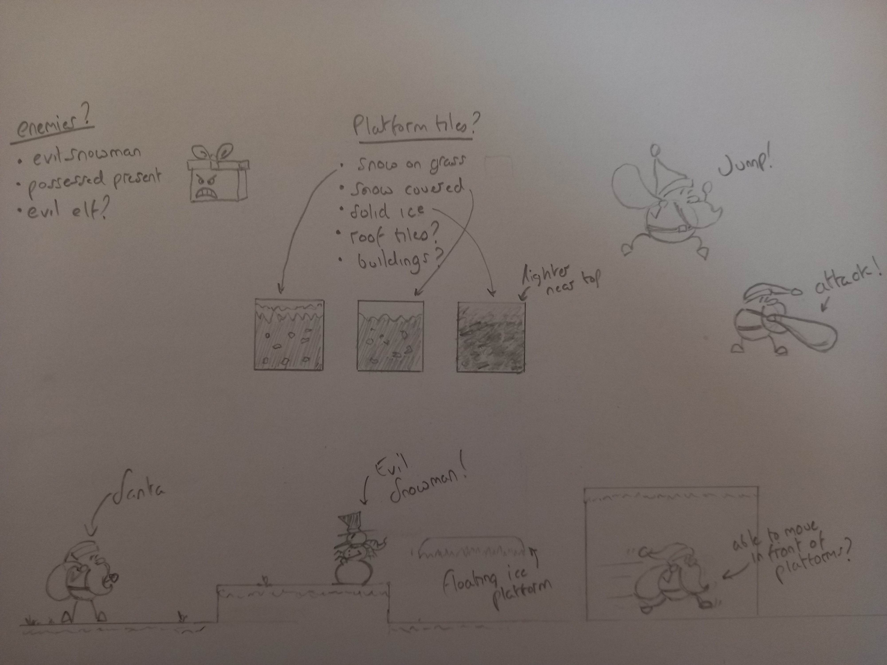
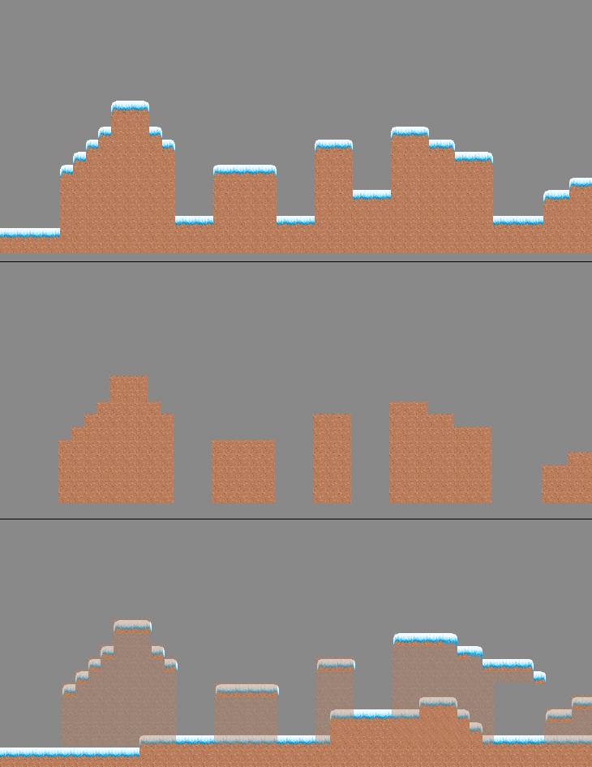
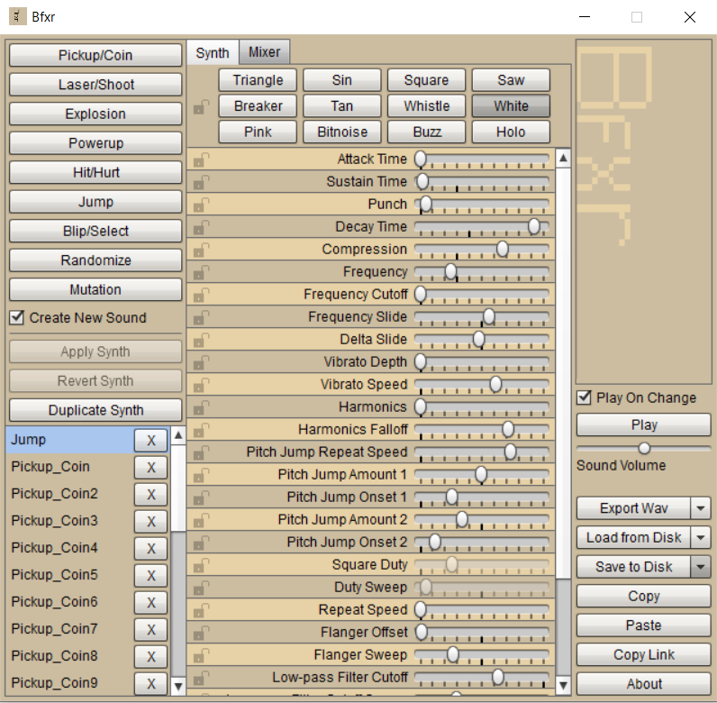
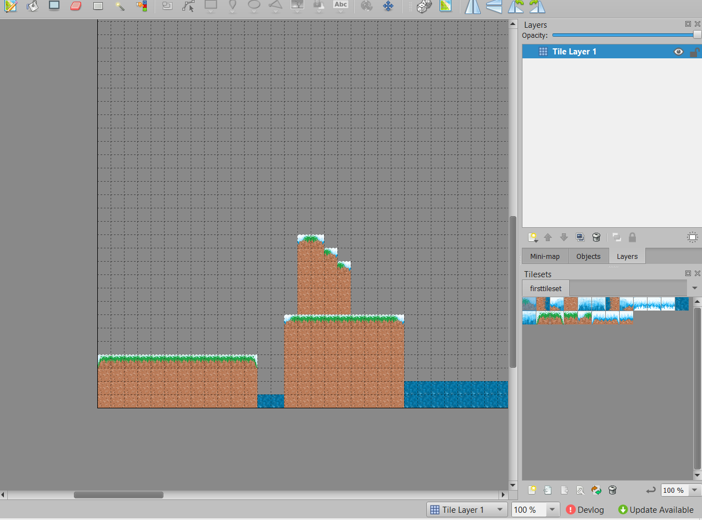
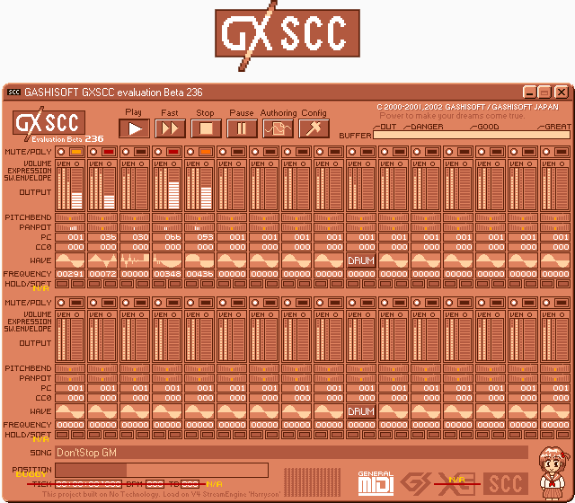

# An Xmas Adventure

Live site: https://andrewdempsey2018.github.io/An-Xmas-Adventure/

<p align="center"></p>
DISASTER!!! It's Chrismas Eve and the forces of evil have succeeded in their nefarious quest to destroy Christmas! Using their patented ReindeerMind technology, they confused Rudolph just enough for the Santa to loose control of the sleigh resulting in all the presents being lost, falling to earth! Santa must now combat the forces of evil to collect all the presents and save Christmas!  
</br>
</br>    
An Xmas Adventure is a retro platfom game. The player takes control of Santa and the goal is to collect as many presents as you can. The more presents you collect the higher Santa will be able to jump, so enabling him to reach more presents. On each level the player should aim to collect as many presents as possible and get to Rudolph before the time runs out!  
</br>
</br>

## Planning & Development

Our team drew sketches of levels beforehand in order to have a visual on how each level will look like, to make the development process easier.


The top image shows both the foreground and background layers as they appear in game. The middle picture shows only the background layer and the bottom image shows both layers but the developer has used the transparency tool in Tiled. The transparency tool is a great resource when working with multi layered tile maps. It allowed us to focus on each particular layer with no visual interference from unrelated assets.
</br>
</br>


<br>

## User Experience (UX)

<hr>

### Initial Discussion

- The user should feel some nostologia due to the retro look and sound of the game.
- The goal the game is straightfoward and simple.
- The controls to be very simple

### First time visitor goal

Our goal for a first time user is to:

- Be able to play immidietly
- Pick up on the controls immidietly
- Feel like their play an NES game

## Features

<hr>

## Existing Features

#### Controls

The user will move Santa using their arrows on their keyboard

#### Sfx

Whenever Santa jumps a sound goes off

#### Soundtrack

The game has fun upbeat retro
<br>

### Features Left to Implement

- The app was not able to be made responsive for use on mobile devices within the alloted project time. This will be a number one priority to implement in the future.

<br>

## Testing

<hr>

<br>

### Bugs & Fixes

- We had an issue where Santa was able to jump multiple times in mid air. Kaboom provides a flag for easily checking weather a character is on the floor. We just needed to apply this flag to asimple if statement in our jumping code:
<br>
```
  //jump
    keyPress("space", () => {
      if (santa.isGrounded()) {
        santa.jump(JUMP_HEIGHT);
        play("jump");
    }
  });
<<<<<<< HEAD
- We had an issue with some images not appearing on the README in Github.


=======
```
>>>>>>> 9b928fb862419926d7fe9944cf0308bc8f1435aa
<br>

### Validator Testing

<br>

## Media

## Deployment

<br>

## Credits

<hr>

The moon image graphic used in the background was sampled from the following image:
https://photos.com/featured/1-winter-moon-yourapechkin.html
<br>

### Langauges used

- Javascript
- HTML
- CSS

### Techonologies used

<hr>

#### BFXR

We used BFXR to generate the games sounds effects. BFXR is a free tool by Stephen Lavelle that generates retro style sound effects and allows them to be exported to various file formats. The UI consists of mixers, dials and buttons that allow easy customisation of waveforms, pitch, reverb and arpeggiation amongst other effects. The tool is used widely in the retro game development community and the assets created from it are licence free. BFXR is packaged as a downloadable executable.
The software can be downloaded at https://www.bfxr.net/



#### Tiled

We used Tiled by Thorbjørn Lindeijer to create our level maps. Tiled is a 2D level editor that helps create tile maps of various forms. It supports straight rectangular tile layers, but also projected isometric, staggered isometric and staggered hexagonal layers. A tile set can be either a single image containing many tiles, or it can be a collection of individual images. In order to support certain depth faking techniques, tiles and layers can be offset by a custom distance and their rendering order can be configured. Tiled also allows layering of tile maps meaning we were able to create a collision layer for Santa to interact with as well as a decoration layer to enhance the background graphics detail.
Tiled is free and available at https://www.mapeditor.org/



#### MIDI

We originally wanted to use a MIDI keyboard to create some Christmas themed music. Our intention was to use an 8 bit VST instrument to produce the classic sound. With the time constraints of the Hackathon, we had to scale back on our plan in this department. Instead, we downloaded free to use Christmas MIDI files from here: https://www.westnet.com/Holiday/midi/

#### GSXCC

We then used a free program called GSXCC by Toda Naoki aka 'GASHISOFT'. This program emulates the sound chips of classic game consoles. It also plays MIDI files and can process MIDI through any of the emulated sound chips. We used the Nintendo NES pre-set and filtered our favourite tunes through it. We feel the music really adds to the overall retro and Christmas feel.
You can download GSXCC emulator here:
https://meme.institute/gxscc/



Used 'colourDesigner' Gradient generator to help with the background sky colours: https://colordesigner.io/gradient-generator

### Workspace

<hr>

#### Gitpod & Visual Studio Code

Both Gitpod and Visual Studio Code were used to develop code.

<br>

#### Version Control

##### Git

For version control we utilized the terminal to add and/or commit to Git and push to GitHub
